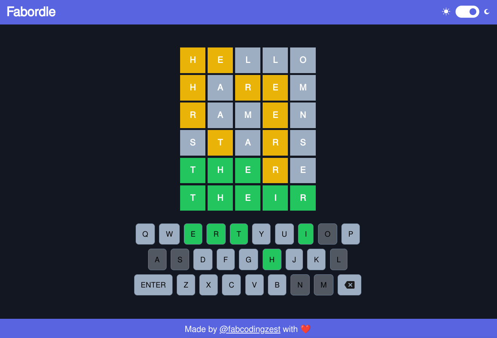

# Fabordle

A word guess game where the user gets 6 chances to guess a random word based on the hints given to guessed words letters. Have Fun! (A [wordle](https://www.nytimes.com/games/wordle/index.html) clone)

## Check it out live here - [https://fabordle.netlify.app/](https://fabordle.netlify.app/)

### Techs Used

- [React JS](https://reactjs.org/)
- [TypeScript](https://www.typescriptlang.org/)
- [Tailwind](https://tailwindcss.com/)

### Features

- Random Word Selected every x minutes
- 5 Guesses
- Keyboard and onScreen keyboard in sync (optional)
- Showing state of guessed words as right or partial right (wrong position)
- game end on right guess

### Want to run this on your local machine?

- Clone the repo
- Add all the dependencies using `npm install`.
- Now run the command `npm run dev` to run the application.

### Author

**[Fab](https://github.com/fabcodingzest)** - _A Frontend Web Developer_
